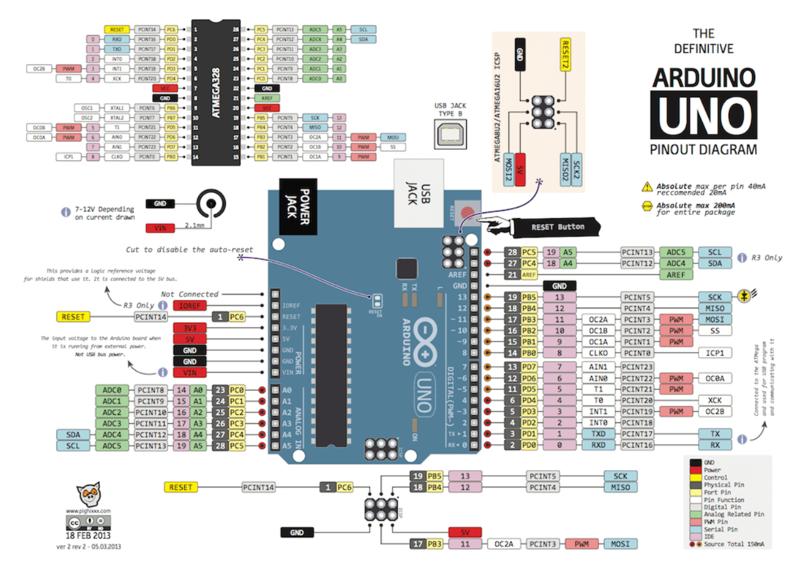
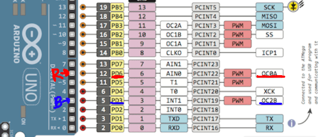
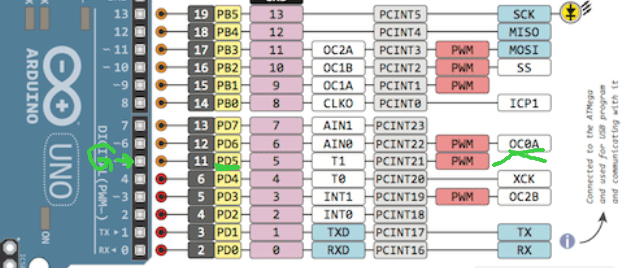
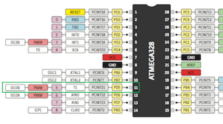
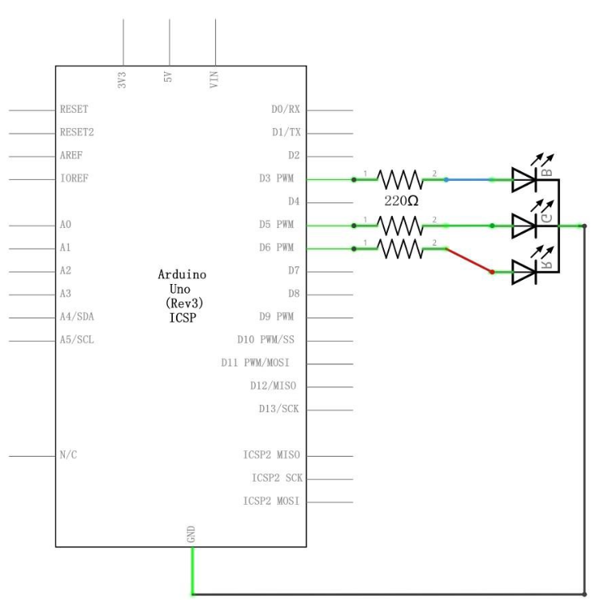
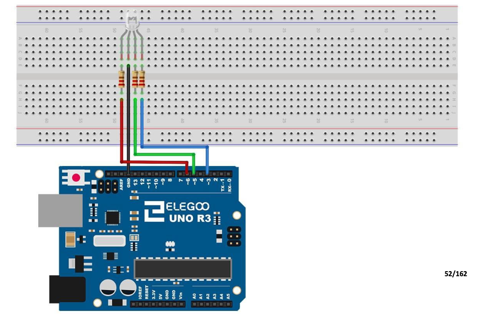
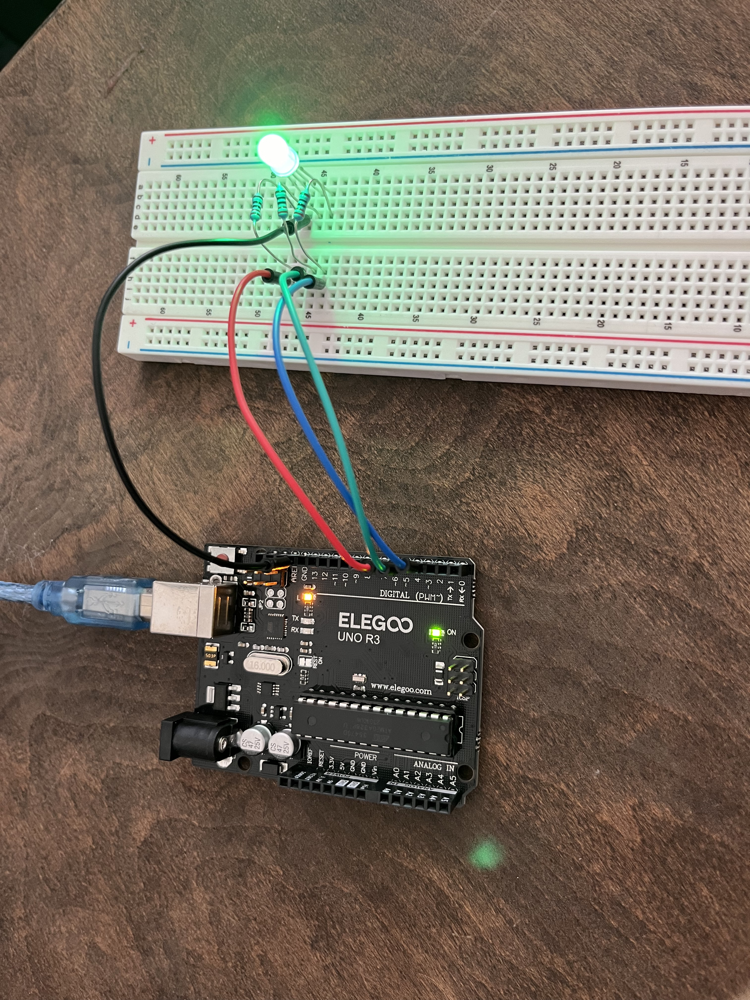
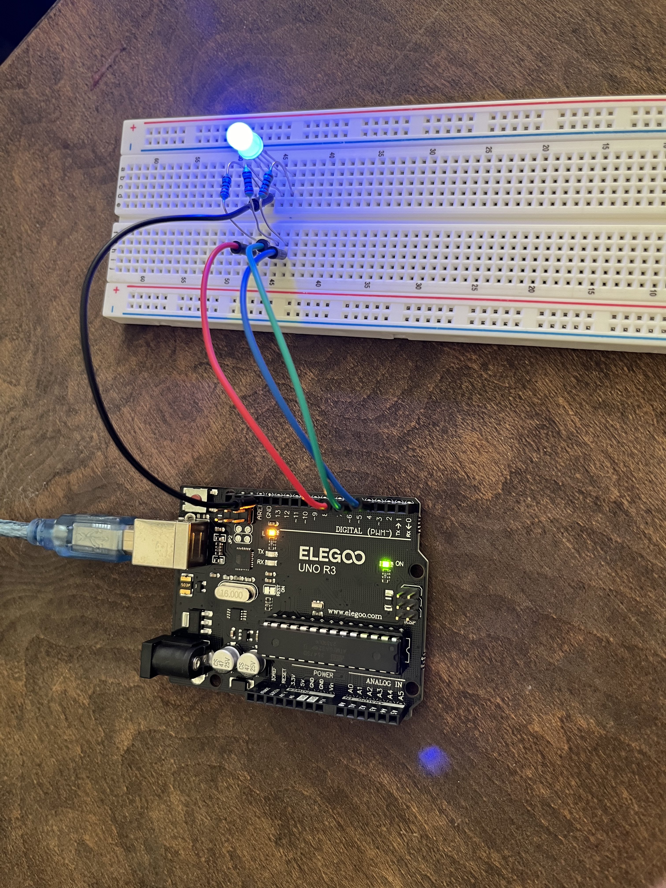
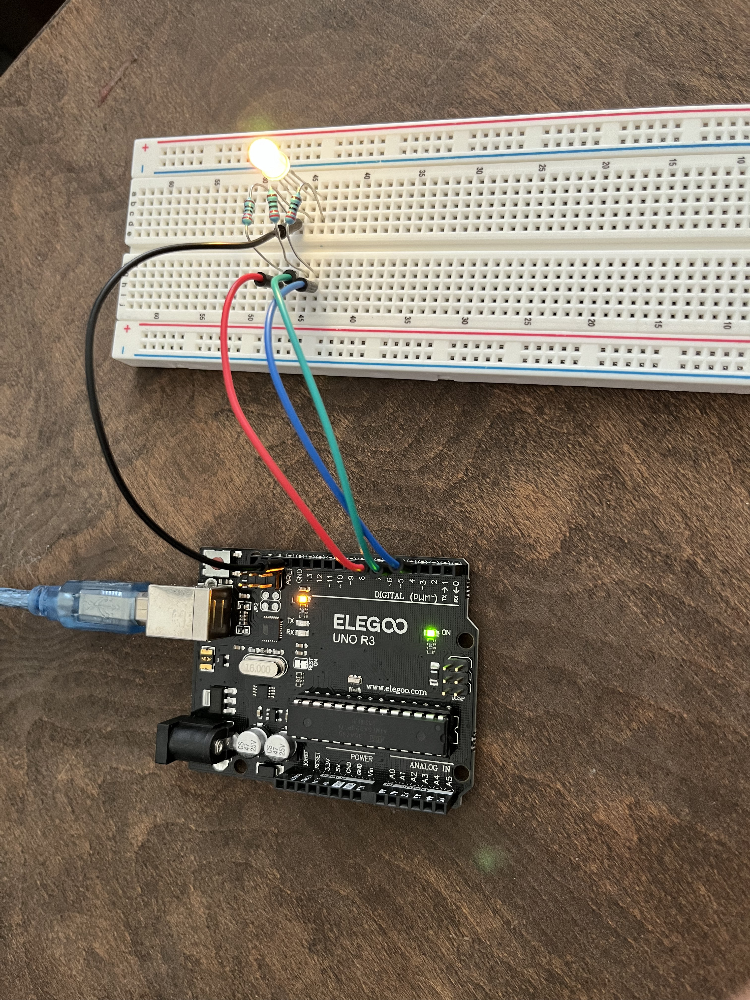

# Lesson 4 RGB LED

## Table of Contents
- [Lesson Plan](#lesson-plan)
    - [Required Components](#required-components)
        - [RBG LED](#rgb-led)
    - [Theory (PWM)](#theory-(pwm))
    - [Key Takeaways](#key-takeaways)
- [Build and Upload Process to Elegoo Uno R3](#build-and-upload-process-to-elegoo-uno-r3)
    - [Run Script](#run-script)
        - [usage](#usage)
    - [Run Manually](#run-manually-with-cmake)
- [Images](#images)

## Lesson Plan

### Required Components

- (1) Elegoo Uno R3
- (1) 830 Tie Points Breadboard
- (4) M-M Wires 
- (1) RGB LED 
- (3) 220 Ohm Resistors 

#### RGB LED

There arethree LEDs, one red, one green and one blue. By controlling the brightness of each of the individual 
LEDs you can mix pretty much any color you want.\
The RGB LED has four leads. There is one lead going to the positive connection of
each of the single LEDs within the package and a single lead that is connected to all
three negative sides of the LEDs.\
Every separate pin for Green or Blue or Red color is called Anode. You will always connect `+` to it. Cathode goes
to `-`(ground). If you connect it other way round the LED will not light.\
The common negative connection of the LED package is the second pin from the flat
side. It is also the longest of the four leads and will be connected to the ground.

### Theory (PWM)

Pulse Width Modulation (PWM) is a technique for controlling power.
We also use it here to control the brightness of each of the LEDs.\
Roughly every 1/500 of a second, the PWM output will produce a pulse. The length
of this pulse is controlled by the `analogWrite` function. So `analogWrite(0)` will not
produce any pulse at all and `analogWrite(255)` will produce a pulse that lasts all the
way until the next pulse is due, so that the output is actually on all the time.
If we specify a value in the analogWrite that is somewhere in between 0 and 255,
then we will produce a pulse. If the output pulse is only high for 5% of the time, then
whatever we are driving will only receive 5% of full power.
If, however, the output is at 5V for 90% of the time, then the load will get 90% of
the power delivered to it. We cannot see the LEDs turning on and off at that speed,
so to us, it just looks like the brightness is changing.

### Key Takeaways

I am not using the built in Arduino IDE libraries. I am using `avr-gcc`, `avr-libc`, & `avrdude` to be able
build and run my processes. Therefore, I cannot use Arduino's `setup` or `analogWrite` functions. 
I had to come up with my own replica functions to map the correct Digital Ports to the ATmega328P's Output Compare Register
, or `OCR` for short. Also, had to configure the respective Timers/Counters for the OCRs. Our configuration for `Timer0`
and `Timer2`, tells `OCR0` and `OCR2` to use PWM.


```c 
#define RED PD6   // Digital Port Pin 6
#define GREEN PD5 // Digital Port Pin 5
#define BLUE PD3  // Digital Port Pin 3
#define DELAY_TIME 10

void setup() {
    // Set pins as outputs
    DDRD |= (1 << RED) | (1 << GREEN) | (1 << BLUE); // Assuming RED, GREEN, BLUE are on PORTB

    // Initialize pin states
    PORTB &= ~((1 << RED) | (1 << GREEN) | (1 << BLUE)); // Set all pins low initially

    // Configure Timer0 for PWM on PB0 (Digital 6) and PB1 (Digital 5)
    TCCR0A = (1 << COM0A1) | (1 << COM0B1) | (1 << WGM00) | (1 << WGM01); // Fast PWM mode, non-inverted
    TCCR0B = (1 << CS00);                                                 // No prescaling

    // Configure Timer2 for PWM on PB2 (Digital 3)
    TCCR2A = (1 << COM2B1) | (1 << WGM20) | (1 << WGM21); // Fast PWM mode, non-inverted
    TCCR2B = (1 << CS00);                                 // No prescaling
}

void analogWrite(uint8_t pin, uint8_t value) {
    switch (pin) {
    case RED:
        OCR0A = value; // Output value to RED pin
        break;
    case GREEN:
        OCR0B = value; // Output value to GREEN pin
        break;
    case BLUE:
        OCR2B = value; // Output value to BLUE pin
        break;
    default:
        break; // do nothing
    }
}

```

Now, tbh, ChatGPT did a decent job of converting the Arduino code to C code, but it failed miserably at mapping the correct
digital ports to OCRs. However, after many hours of troubleshooting, I was able to find this image to help map the correct ports.



Red and Blue were easy to determine which Digital Port mapped to which OCR. Due to how I wired everything 
together, the Red LED pin was wired to DP 6 and looking at the image you can see mapped to OC0A. Blue LED
pin was wired to DP 3 which mapped to OC2B.



Now, the Green LED pin was wired to DP 5. There was no OCR mapping next to it. However, to the left of PD5, we see DP 5
corresponds to ATmega328P physical pin 11.



If we go over to the ATmega328P chip, we can find the correct OCR needed to for the Green LED Pin by locating the 0
Finally, if we look at ATmega328P physical pin 11, we can see PD5 maps to OC0B.




## Build and Upload Process to Elegoo Uno R3

### Run Script

The `run.sh` script automates the process of running shell commands to build and upload the process 
to the Elegoo Uno R3. 

#### Usage

*NOTE: Make sure you are in the root directory of the lesson 4 before running the script.*

To use the script with the default port /dev/cu.usbmodem101, simply run:

```sh 
./scripts/run.sh
```

If you need to use a different port, you can still provide it as an argument:

```sh 
./scripts/run.sh /dev/cu.otherport
```

### Run Manually with CMake

1. Create build directory and navigate into it

```sh 
mkdir -p build && cd build
```

2. Run CMake with the custom toolchain file

```sh 
cmake -DCMAKE_TOOLCHAIN_FILE=../avr-gcc-toolchain.cmake ..
```

3. Build the project

```sh 
make
```

4. Upload the program to the board

```sh 
avrdude -c arduino -p m328p -P $PORT -b 115200 -U flash:w:rgb_led.hex:i
```

## Images

#### Connection Schematic



#### Wiring Diagram



#### Examples






