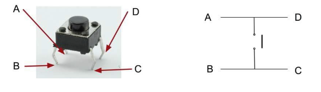
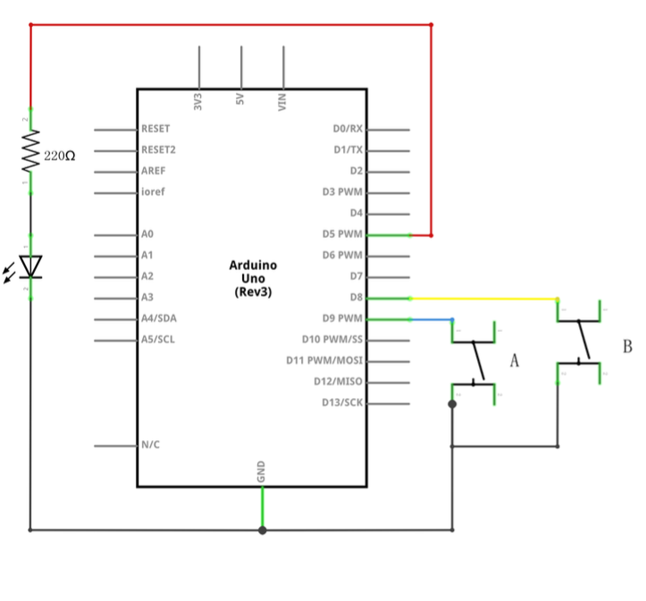
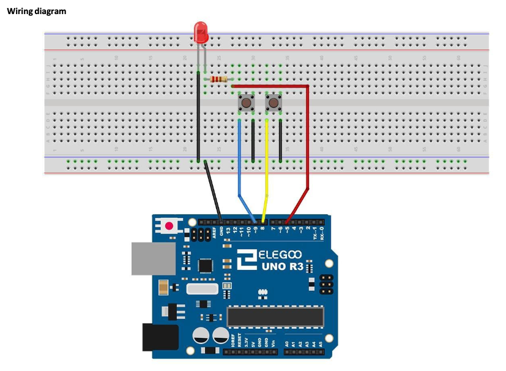
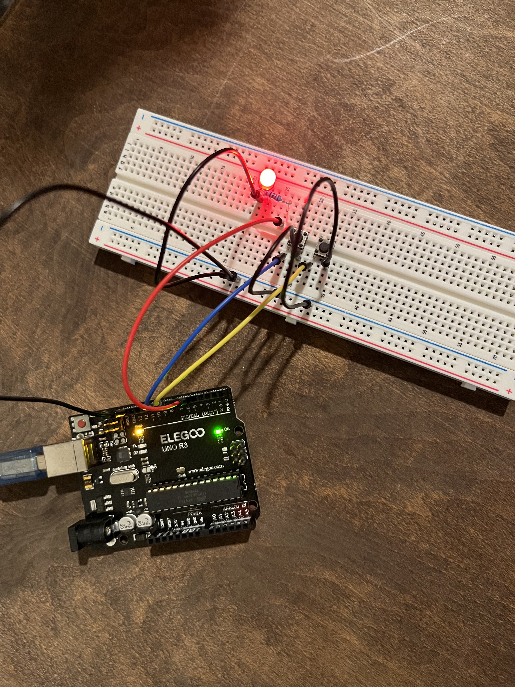
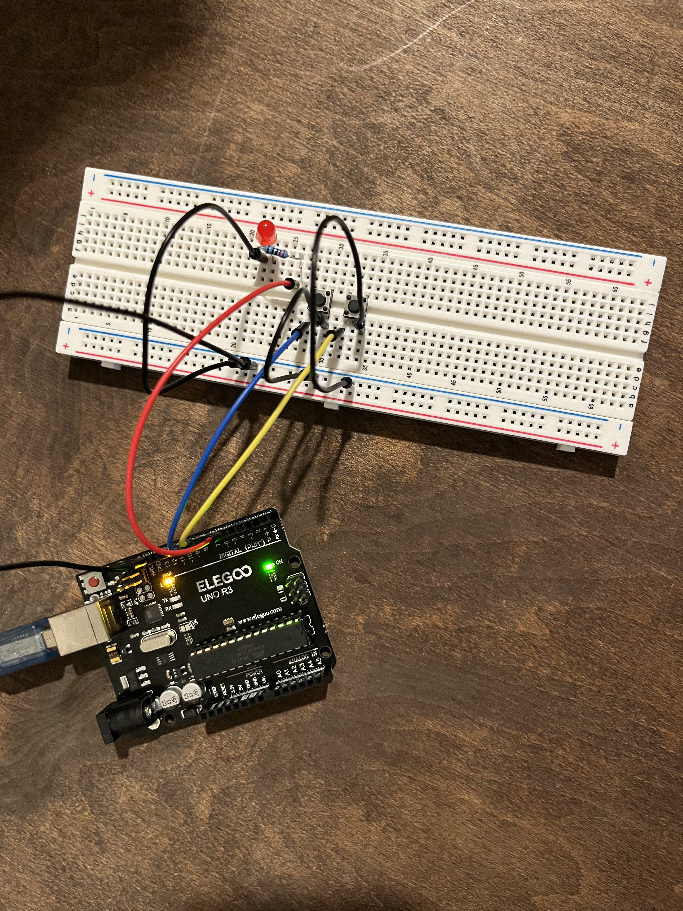
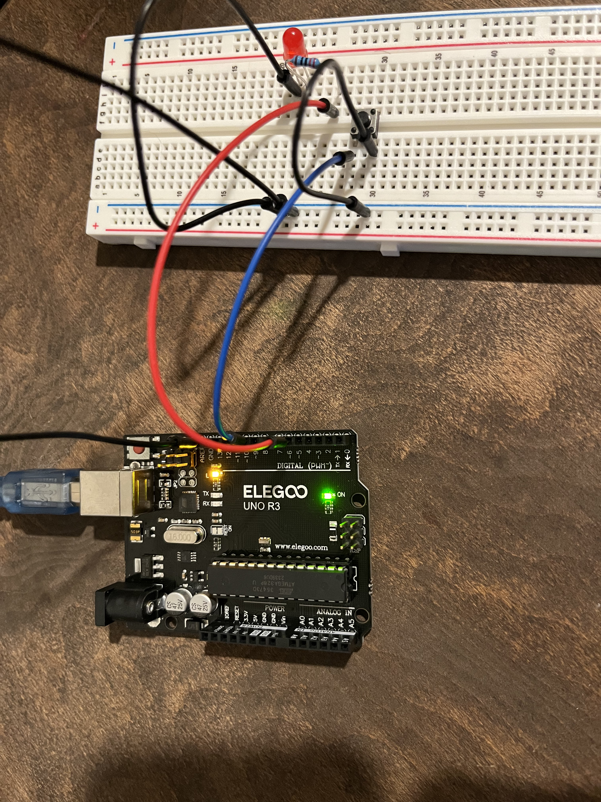
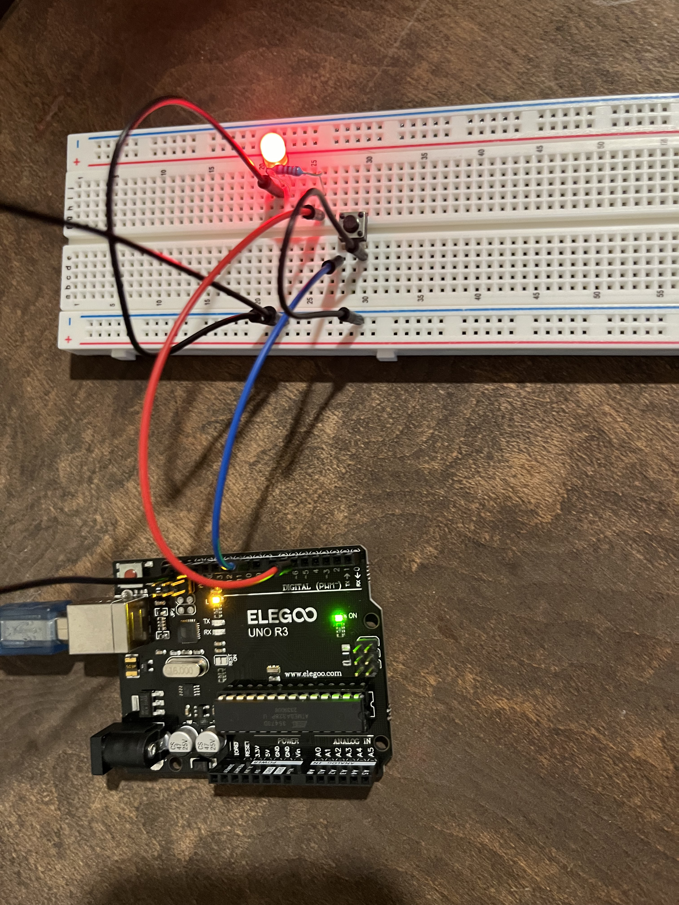
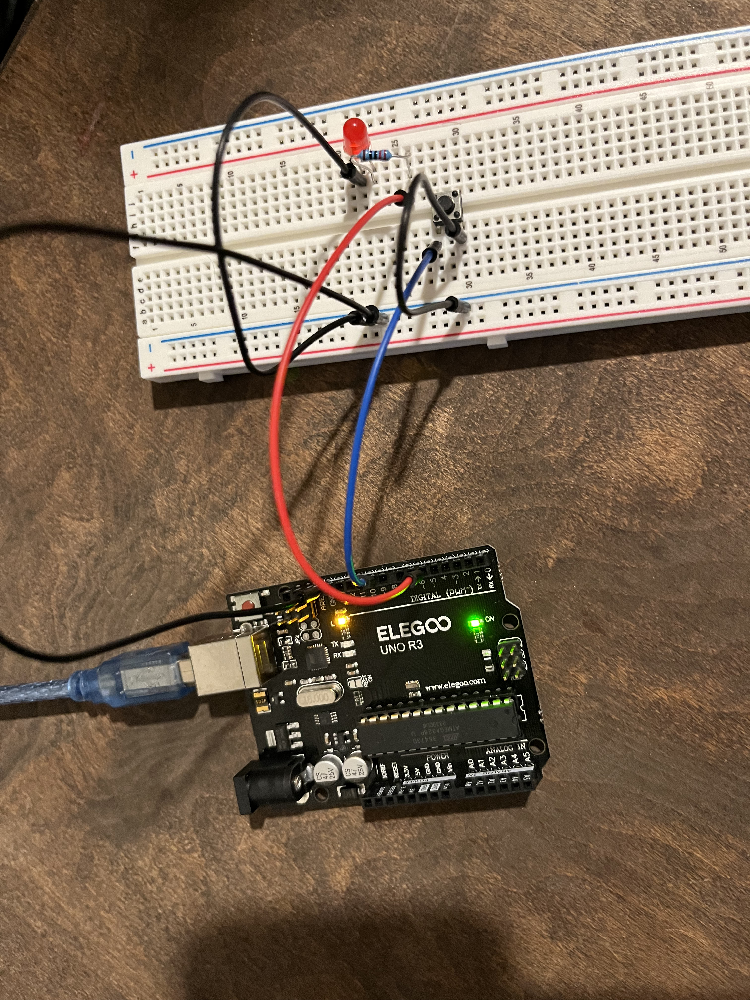

# Lesson 5 Digital Inputs

## Table of Contents
- [Lesson Plan](#lesson-plan)
    - [Required Components](#required-components)
        - [Push Switches](#push-switches)
    - [Key Takeaways](#key-takeaways)
    - [Images](#images)
    - [Additional Challenge](#additional-challenge)
- [Build and Upload Process to Elegoo Uno R3](#build-and-upload-process-to-elegoo-uno-r3)
    - [Run Script](#run-script)
        - [usage](#usage)
    - [Run Manually](#run-manually-with-cmake)

## Lesson Plan

### Required Components

- (1) Elegoo Uno R3
- (1) 830 Tie Points Breadboard
- (1) Red LED 
- (1) 220 Ohm Resistors 
- (2) Push Switches 
- (7) M-M Wires 

#### Push Switches

Switches are really simple components. When you press a button or flip a lever, they
connect two contacts together so that electricity can flow through them.
The little tactile switches that are used in this lesson have four connections, which
can be a little confusing.



Actually, there are only really two electrical connections. Inside the switch package,
pins B and C are connected together, as are A and D.

### Key Takeaways

I spent too much time trying to debug my code, when it was actually an error with how I setup
the circuit. I had inserted the red led in the wrong way. Instead of connecting negative to ground,
I had connected positive to ground. So this is a reminder to always double check your wiring/circuit!!

### Images

#### Connection Schematic



#### Wiring Diagram



#### Outcome






### Additional Challenge

Update the code and circuit to only allow one switch to toggle on/off the red led.







## Build and Upload Process to Elegoo Uno R3

### Run Script

The `run.sh` script automates the process of running shell commands to build and upload the process 
to the Elegoo Uno R3. 

#### Usage

*NOTE: Make sure you are in the root directory of the lesson 4 before running the script.*

To use the script with the default port /dev/cu.usbmodem101, simply run:

```sh 
./scripts/run.sh
```

If you need to use a different port, you can still provide it as an argument:

```sh 
./scripts/run.sh /dev/cu.otherport
```

### Run Manually with CMake

1. Create build directory and navigate into it

```sh 
mkdir -p build && cd build
```

2. Run CMake with the custom toolchain file

```sh 
cmake -DCMAKE_TOOLCHAIN_FILE=../avr-gcc-toolchain.cmake ..
```

3. Build the project

```sh 
make
```

4. Upload the program to the board

```sh 
avrdude -c arduino -p m328p -P $PORT -b 115200 -U flash:w:main.hex:i
```
