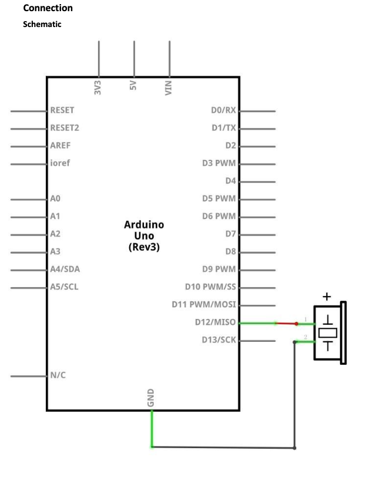
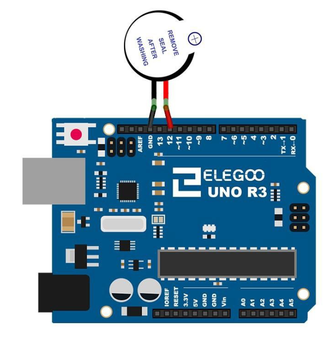

# Lesson 6 Active Buzzer 

## Table of Contents
- [Lesson Plan](#lesson-plan)
    - [Required Components](#required-components)
        - [Active Buzzer](#active-buzzer)
    - [Key Takeaways](#key-takeaways)
    - [Images](#images)
- [Build and Upload Process to Elegoo Uno R3](#build-and-upload-process-to-elegoo-uno-r3)
    - [Run Script](#run-script)
        - [usage](#usage)
    - [Run Manually](#run-manually-with-cmake)

## Lesson Plan

### Required Components

- (1) Elegoo Uno R3
- (1) Active Buzzer
- (2) F-M wires (Female to Male DuPont wires) 

#### Active Buzzer
Electronic buzzers are DC-powered and equipped with an integrated circuit. They
are widely used in computers, printers, photocopiers, alarms, electronic toys,
automotive electronic devices, telephones, timers and other electronic products for
voice devices. Buzzers can be categorized as active and passive ones. Active buzzer 
has a built-in oscillating source, so it will generate a sound when electrified. 
A passive buzzer does not have such a source so it will not tweet if DC signals are used; 
instead, you need to use square waves whose frequency is between 2K and 5K to drive it.
The active buzzer is often more expensive than the passive one because of multiple built-in 
oscillating circuits.

### Key Takeaways

This one was pretty straight forward. Typically, I used ChatGPT to convert the lesson's arduino code 
to C code with avrgcc, but I challenged myself to do this one on my own. Again, referencing the 
pinout diagram from Ch. 4, was a big help mapping the physical pin to the port pin. \
The only issue I had was remembering how to initialize, activate, and deactivate the needed pins. Again,
I just reference code from previous lessons. After that, the only other issue I had was a compile time error
from the `_delay_ms` function. It expects a compile time integer constant as an argument. However, I was
passing in a variable, causing it throw that error. Therefore, I created my own wrapper function to solve
this error. 

```c
void delay_ms(uint16_t ms) {
    while (ms) {
        _delay_ms(1);
        ms--;
    }
}

// usage in main function
uint16_t sound_duration = 500;
for (int i = 0; i < 20; i++) {
    if (i < 5) {
        sound_duration = 500;
    } else if (i < 10) {
        sound_duration = 300;
    } else if (i < 20) {
        sound_duration = 100;
    }

    PORTB |= (1 << BUZZER_PIN);
    delay_ms(sound_duration);

    PORTB &= ~(1 << BUZZER_PIN);
    delay_ms(sound_duration);
}
```

### Images

#### Connection Schematic



#### Wiring Diagram



#### Outcome


## Build and Upload Process to Elegoo Uno R3

### Run Script

The `run.sh` script automates the process of running shell commands to build and upload the process 
to the Elegoo Uno R3. 

#### Usage

*NOTE: Make sure you are in the root directory of the lesson 6 before running the script.*

To use the script with the default port /dev/cu.usbmodem101, simply run:

```sh 
./scripts/run.sh
```

If you need to use a different port, you can still provide it as an argument:

```sh 
./scripts/run.sh /dev/cu.otherport
```

### Run Manually with CMake

1. Create build directory and navigate into it

```sh 
mkdir -p build && cd build
```

2. Run CMake with the custom toolchain file

```sh 
cmake -DCMAKE_TOOLCHAIN_FILE=../avr-gcc-toolchain.cmake ..
```

3. Build the project

```sh 
make
```

4. Upload the program to the board

```sh 
avrdude -c arduino -p m328p -P $PORT -b 115200 -U flash:w:main.hex:i
```
