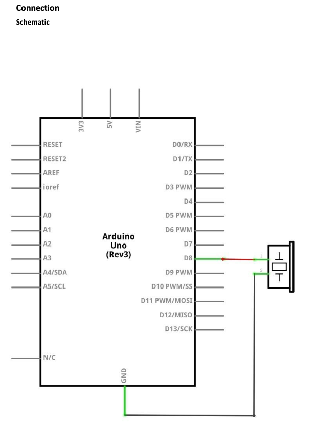
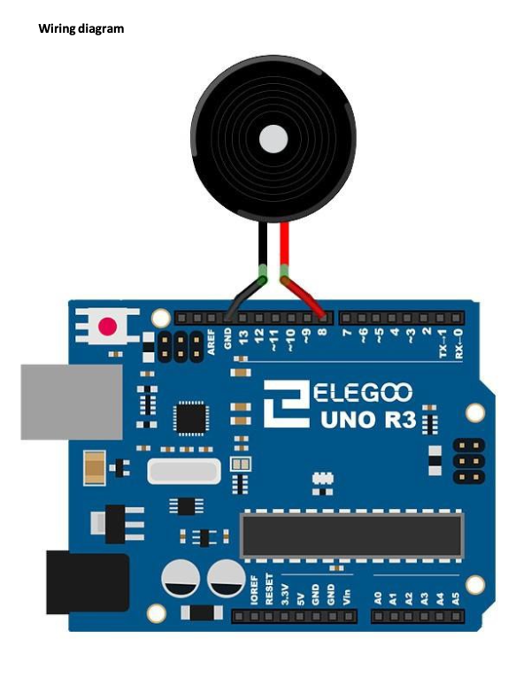

# Lesson 7 Passive Buzzer 

## Table of Contents
- [Lesson Plan](#lesson-plan)
    - [Required Components](#required-components)
        - [Passive Buzzer](#passive-buzzer)
    - [Key Takeaways](#key-takeaways)
    - [Images](#images)
- [Build and Upload Process to Elegoo Uno R3](#build-and-upload-process-to-elegoo-uno-r3)
    - [Run Script](#run-script)
        - [usage](#usage)
    - [Run Manually](#run-manually-with-cmake)

## Lesson Plan

### Required Components

- (1) Elegoo Uno R3
- (1) Passive Buzzer
- (2) F-M wires (Female to Male DuPont wires) 

#### Passive Buzzer
The working principle of passive buzzer is using PWM generating audio to make the
air to vibrate. Appropriately changed as long as the vibration frequency, it can
generate different sounds. For example, sending a pulse of 523Hz, it can generate
Alto Do, pulse of 587Hz, it can generate midrange Re, pulse of 659Hz, it can produce
midrange Mi. By the buzzer, you can play a song.

### Key Takeaways

Connecting the components was not difficult this time. Connect positive to physical pin 14,
connect other pin to ground. The only difficult part was trying to migrate the Arduino code 
to C code. I still have a lot to learn in this aspect.

### Images

#### Connection Schematic



#### Wiring Diagram



#### Outcome


## Build and Upload Process to Elegoo Uno R3

### Run Script

The `run.sh` script automates the process of running shell commands to build and upload the process 
to the Elegoo Uno R3. 

#### Usage

*NOTE: Make sure you are in the root directory of the lesson 6 before running the script.*

To use the script with the default port /dev/cu.usbmodem101, simply run:

```sh 
./scripts/run.sh
```

If you need to use a different port, you can still provide it as an argument:

```sh 
./scripts/run.sh /dev/cu.otherport
```

### Run Manually with CMake

1. Create build directory and navigate into it

```sh 
mkdir -p build && cd build
```

2. Run CMake with the custom toolchain file

```sh 
cmake -DCMAKE_TOOLCHAIN_FILE=../avr-gcc-toolchain.cmake ..
```

3. Build the project

```sh 
make
```

4. Upload the program to the board

```sh 
avrdude -c arduino -p m328p -P $PORT -b 115200 -U flash:w:main.hex:i
```
